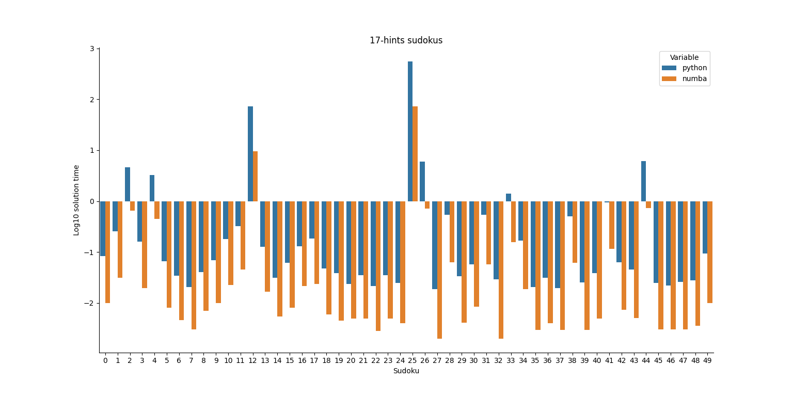

## Python Sudoku solver (with backtracking)

Simple and fast sudoku solver in python, which can either generate original sudokus and solve them or accept grids to 
solve from external files. It uses **backtracking** and **code compilation** through _numba_ to boost performance.

Feel free to download and experiment with the code as you wish.

### Installation
Using PIP (you may want to create a virtual environment) when in the repository directory,

> pip install .

If you want to install it in development mode (all the changes to the code will be reflected in the installed packages),
just add the _-e_ flag, i.e.

> pip install -e .

### Basic usage

> python main.py

generates a 9x9 Sudoku with 17 hints and solves it, while

> python main.py --input (filename)

loads the grid from the specified file (see _sources/doku.txt_ for an example on how the grid should be specified).

### Tests

A minimal suite of tests is provided to assess the functionality of the code. To run them all, just fire _pytest_ while
in the correct environment

> pytest

This is especially useful if in development mode, since all the tests can be runned on the updated code with a single
command.

### Main Features

#### Backtracking
The program uses a backtracking approach for solving sudokus. It is sufficiently fast for 9x9 grids, with any number 
of constraints. For 16x16 grids, instead, in some cases it is painfully slow (other algorithms will be likely implemented).

#### Just-in-time Compiled Code
The backtracking and checking procedures are written in a way such that using [numba](https://www.google.com/url?sa=t&rct=j&q=&esrc=s&source=web&cd=&cad=rja&uact=8&ved=2ahUKEwjuiciqiK7yAhVwhv0HHR1YAnEQFnoECAgQAw&url=http%3A%2F%2Fnumba.pydata.org%2F&usg=AOvVaw38D5R_3JXRfxT6KPHDCZGs), JIT compilation can be easily 
introduced while writing the code in plain python. With it, the performance is greatly improved already with 9x9 grids.
It is expected that for greater sudokus (e.g. 16x16). the benefit be even higher. See the picture below for a comparison
over 50 solved grids.

